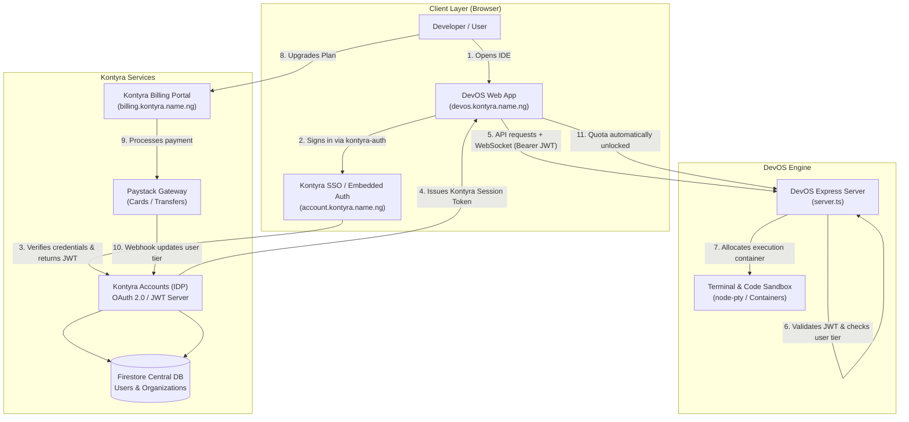

# DevOS × Kontyra: Complete Architecture & Full Integration Blueprint

> **System Target**: Unify DevOS Code Execution Platform (`devos.kontyra.name.ng`) with Kontyra Identity Cloud (`account.kontyra.name.ng`) and Kontyra Billing Portal (`billing.kontyra.name.ng`).

---

## 1. High-Level System Architecture

DevOS operates as a flagship connected application within the Kontyra ecosystem. Instead of maintaining an isolated Firebase Authentication silo and independent credit purchasing, DevOS leverages Kontyra's central identity, single sign-on (SSO), and Paystack-powered subscription tiers.



---

## 2. Authentication & Session Synchronization

### Current Status in DevOS
Currently, DevOS initializes a standalone Firebase Client instance in `src/lib/firebase.ts` with project `gen-lang-client-0410328437`. This causes:
- Fragmented accounts: A user registering in DevOS is not recognized in Kontyra Accounts or other Kontyra apps.
- Missing custom fields: `@username` and organization memberships aren't synchronized.

### The Unified Solution with `kontyra-auth`
By integrating the `@kontyra/auth` (or `kontyra-auth`) SDK:
1. DevOS wraps its root React tree in `<KontyraProvider appId="devos">`.
2. Users can log in using their universal Kontyra credentials:
   - Email & Password
   - In-app Passwordless Magic Link
   - Universal `@username` login
   - Google / GitHub Social SSO via Kontyra
3. The resulting JWT carries universal profile information:
   ```json
   {
     "uid": "usr_9482019",
     "email": "developer@example.com",
     "username": "alex",
     "fullName": "Alex Developer",
     "role": "developer",
     "tier": "developer",
     "appId": "devos",
     "iat": 1758849200,
     "exp": 1758935600
   }
   ```

### Implementation Code in DevOS Frontend (`src/main.tsx` or `src/App.tsx`)

```tsx
import React from "react";
import ReactDOM from "react-dom/client";
import { KontyraProvider } from "kontyra-auth/react";
import App from "./App";
import "./index.css";

ReactDOM.createRoot(document.getElementById("root")!).render(
  <React.StrictMode>
    <KontyraProvider
      config={{
        domain: "https://account.kontyra.name.ng",
        appId: "devos",
        redirectUri: window.location.origin,
      }}
    >
      <App />
    </KontyraProvider>
  </React.StrictMode>
);
```

In any component (e.g. Navigation bar or Login Modal):
```tsx
import { useKontyraAuth } from "kontyra-auth/react";

export function HeaderAuth() {
  const { user, loginWithPopup, logout, loading } = useKontyraAuth();

  if (loading) return <div>Loading...</div>;

  if (user) {
    return (
      <div className="flex items-center gap-3">
        <span>@{user.username}</span>
        <span className="badge">{user.tier.toUpperCase()}</span>
        <button onClick={logout}>Sign Out</button>
      </div>
    );
  }

  return <button onClick={() => loginWithPopup()}>Sign In with Kontyra</button>;
}
```

---

## 3. Protecting DevOS Code Execution APIs (`server.ts`)

DevOS runs an Express server (`server.ts`) that manages container execution, project files, and terminal WebSockets (`node-pty`).

### Securing Express Routes
To ensure that only authenticated developers with valid Kontyra quotas can execute code:

```typescript
import jwt from "jsonwebtoken";
import type { Request, Response, NextFunction } from "express";

export interface AuthenticatedRequest extends Request {
  user?: {
    uid: string;
    email: string;
    username: string;
    tier: "free" | "developer" | "growth" | "business" | "enterprise";
    scopes: string[];
  };
}

export function requireKontyraAuth(req: AuthenticatedRequest, res: Response, next: NextFunction) {
  const authHeader = req.headers.authorization;
  if (!authHeader || !authHeader.startsWith("Bearer ")) {
    return res.status(401).json({ success: false, error: "Missing or malformed Authorization header." });
  }

  const token = authHeader.split(" ")[1];
  const secret = process.env.KONTYRA_JWT_SECRET || "kontyra_default_shared_secret";

  try {
    const decoded = jwt.verify(token, secret) as any;
    req.user = {
      uid: decoded.uid,
      email: decoded.email,
      username: decoded.username,
      tier: decoded.tier || "free",
      scopes: decoded.scopes || [],
    };
    next();
  } catch (err: any) {
    return res.status(401).json({ success: false, error: "Invalid or expired Kontyra session token." });
  }
}
```

### Protecting Execution Endpoints
```typescript
app.post("/api/projects/:projectId/run", requireKontyraAuth, async (req: AuthenticatedRequest, res) => {
  const user = req.user!;
  
  // Check quotas based on Kontyra tier
  const tierLimits = {
    free: { maxExecutionSeconds: 30, memoryMb: 512 },
    developer: { maxExecutionSeconds: 300, memoryMb: 2048 },
    growth: { maxExecutionSeconds: 900, memoryMb: 4096 },
    business: { maxExecutionSeconds: 3600, memoryMb: 8192 },
  };

  const limit = tierLimits[user.tier] || tierLimits.free;
  
  // Launch execution container with allocated resource boundaries...
});
```

---

## 4. Subscription Tiers & Resource Allocation Matrix

| Feature / Quota | Community Free ($0/mo) | Developer Tier (₦15k/mo) | Growth Tier (₦45k/mo) | Business Tier (₦125k/mo) |
| :--- | :--- | :--- | :--- | :--- |
| **Max Concurrent Sandboxes** | 2 | 10 | 25 | Unlimited |
| **Execution Timeout** | 30 seconds | 5 minutes | 15 minutes | 60 minutes |
| **Container RAM / CPU** | 512 MB / 0.5 vCPU | 2 GB / 1 vCPU | 4 GB / 2 vCPU | 8 GB / 4 vCPU |
| **Permanent Deployed Apps** | 3 projects | 15 projects | 50 projects | 200 projects |
| **Subdomain Format** | `project-user.devos.kontyra.name.ng` | `project.apps.kontyra.name.ng` | Custom CNAME + SSL | Custom CNAME + SSL |
| **Team Collaboration** | Read-only sharing | Up to 3 editors | Up to 15 editors | Unlimited RBAC seats |

---

## 5. Billing & Instant Upgrade Deep-Linking

When a developer exceeds their Free tier limit in DevOS (e.g. attempting to run a 3rd concurrent container or deploy a 4th project), DevOS should prompt an upgrade:

```tsx
export function UpgradeModal({ currentTier }: { currentTier: string }) {
  const handleUpgrade = (targetTier: string) => {
    const returnUrl = encodeURIComponent(window.location.href);
    window.location.href = `https://billing.kontyra.name.ng/?plan=${targetTier}&returnUrl=${returnUrl}`;
  };

  return (
    <div className="upgrade-dialog">
      <h3>Resource Limit Reached</h3>
      <p>Upgrade to the Developer Tier to unlock 10 concurrent sandboxes and high-performance containers.</p>
      <button onClick={() => handleUpgrade("developer")}>
        Upgrade on Kontyra Billing &rarr;
      </button>
    </div>
  );
}
```

---

## 6. Project Subdomains & Hosting Routing (`brand.ts`)

DevOS already contains an established subdomain taxonomy in `src/lib/brand.ts`:
- **`devos.kontyra.name.ng`**: Primary Web IDE and dashboard.
- **`{username}.devos.kontyra.name.ng`**: Developer portfolio page.
- **`{project}-{username}.devos.kontyra.name.ng`**: Free tier project previews.
- **`{project}-{appId}.apps.kontyra.name.ng`**: Paid tier production deployments.
- **`{orgSlug}.org.devos.kontyra.name.ng`**: Organization team workspace.

By connecting to Kontyra Accounts:
1. `username` is strictly validated and guaranteed unique across all Kontyra apps.
2. `orgSlug` is strictly validated and guaranteed unique across all B2B organizations.
3. Subdomain collisions are mathematically prevented at the API registration boundary.

---

## 7. Migration & Rollout Checklist

- [ ] **Phase 1: Package Linking**
  - Install `kontyra-auth` in DevOS (`npm install kontyra-auth` or vendor package).
  - Wrap `src/main.tsx` in `<KontyraProvider>`.
- [ ] **Phase 2: Authentication Bridge**
  - Replace `src/lib/userService.ts` sign-up logic with `useKontyraAuth()`.
  - Deprecate old standalone Firebase auth popup calls.
- [ ] **Phase 3: Backend JWT Guard**
  - Add `requireKontyraAuth` middleware in `DevOS/server.ts`.
  - Pass `Authorization: Bearer ${user.token}` on all WebSocket and terminal execution requests.
- [ ] **Phase 4: Billing Quotas & UI**
  - Connect `creditsService.ts` to `user.tier`.
  - Wire up upgrade deep-links pointing to `https://billing.kontyra.name.ng`.
